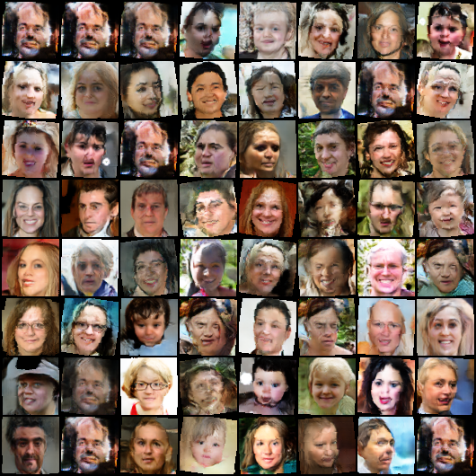
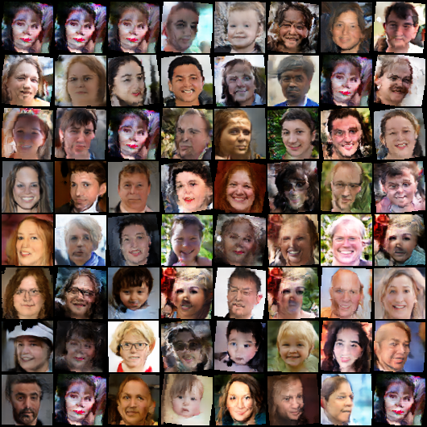
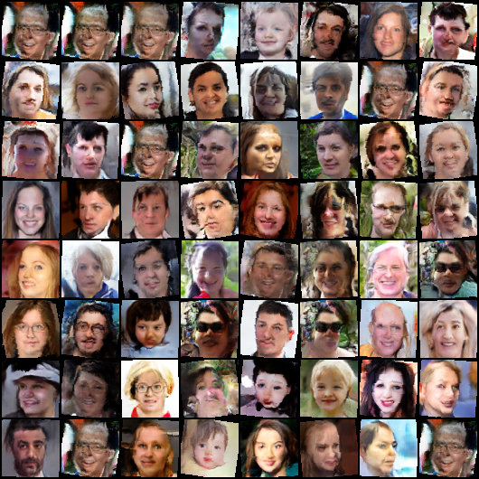
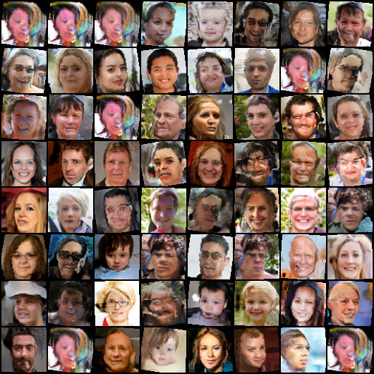
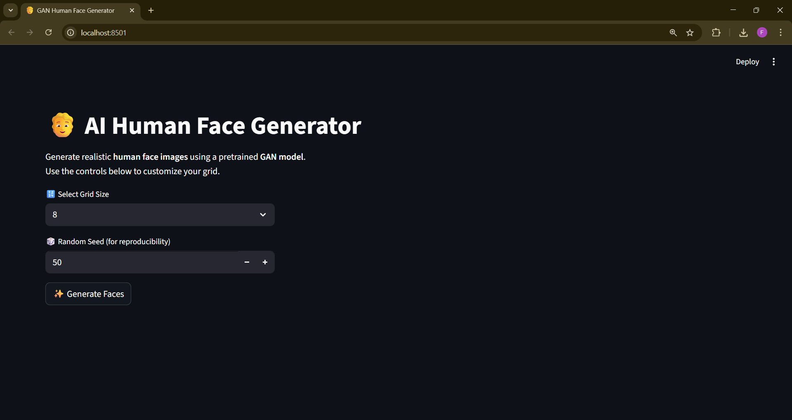

# RIG_GAN – AI Human Face Generator

A **Generative Adversarial Network (GAN)** based project that generates **realistic human face images**.
This project uses a **pre-trained DCGAN Generator model** integrated with a **Streamlit** web app for easy interaction.

---

## Project Structure

```
RIG_GAN/
│
├── checkpoints/               # Pre-trained GAN model weights
├── generated_images/          # Generated faces will be saved here
├── screenshots/               # App screenshots 
├── venv/                      # Virtual environment 
├── app.py                     # Streamlit app to run the GAN interface
├── model.py                   # Contains Generator model definition
├── Image_Generation.ipynb     # Jupyter Notebook for training or experiments
├── requirements.txt           # Python dependencies
└── LICENSE.txt                # License file
```

---

## Features

* Generate **AI-based human faces** instantly.
* Customizable **grid size** (4×4, 6×6, 8×8).
* **Reproducible outputs** using a random seed.
* Download generated grids as **.png** images.
* Simple, interactive **Streamlit web UI**.

---

## Tech Stack

* **Python 3.10+**
* **PyTorch** – for model loading and inference
* **Streamlit** – for user interface
* **Torchvision** – for image utilities
* **NumPy**, **Pillow** – image processing

---

## Installation

1. **Clone the repository**

   ```bash
   git clone https://github.com/yourusername/RIG_GAN.git
   cd RIG_GAN
   ```

2. **Create and activate a virtual environment**

   ```bash
   python -m venv venv
   venv\Scripts\activate      # On Windows
   source venv/bin/activate   # On macOS/Linux
   ```

3. **Install dependencies**

   ```bash
   pip install -r requirements.txt
   ```

4. **Verify model checkpoint**
   Make sure the checkpoint file is present inside the `checkpoints/` directory.

---

## Run the App

Start the Streamlit app:

```bash
streamlit run app.py
```

Once the app is running, open the **local URL** (usually `http://localhost:8501`) in your browser.

---

## How It Works

1. The **Generator** network (from `model.py`) takes a random noise vector of size `100×1×1`.
2. It outputs a **synthetic face image** of size `3×64×64`.
3. A grid of generated faces is displayed in the Streamlit UI.
4. You can adjust the **grid size** and **random seed** for different variations.

---

## 📸 Example Output

  

  
  
 

---

## License

This project is licensed under the terms of the **MIT License**.
See [`LICENSE.txt`](./LICENSE.txt) for details.

---

## Future Improvements

* Add GPU acceleration support (CUDA).
* Integrate StyleGAN for higher-resolution faces.
* Allow latent vector interpolation.
* Deploy online using Streamlit Cloud or Hugging Face Spaces.

---